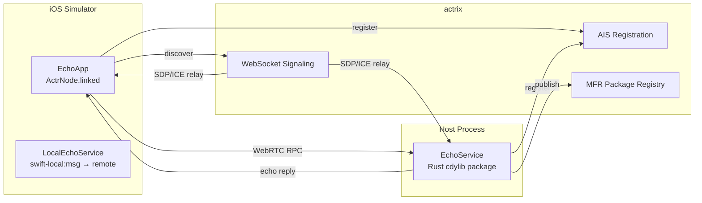
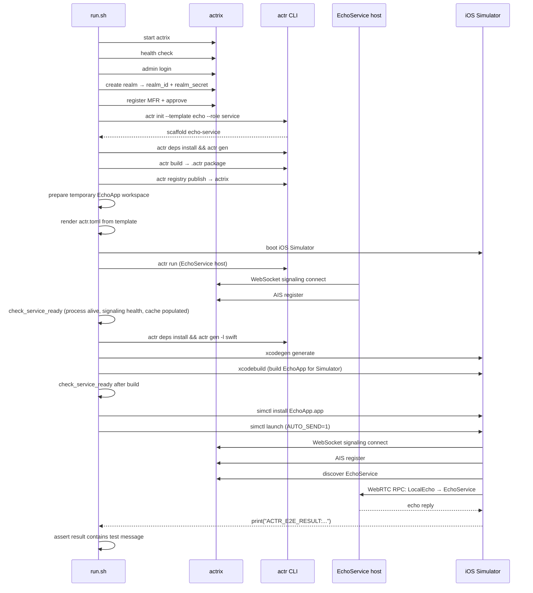

# Swift EchoApp E2E

End-to-end test that verifies an iOS app (EchoApp, linked runtime) can discover and call a remote EchoService through actrix signaling + WebRTC — all running locally on CI.

## Architecture



## Flow



## File Structure

```
e2e/swift-echo-app/
├── run.sh                # CI orchestration script
├── actr.toml.tpl         # Runtime config template (rendered → actr.toml)
├── actr.lock.toml         # Runtime lock placeholder bundled with EchoApp
├── manifest.toml         # Package identity + EchoService dependency
├── project.yml           # XcodeGen project spec + scheme env vars
├── protos/
│   ├── local/local_echo.proto
│   └── remote/echo/echo.proto
└── EchoApp/
    ├── ActrService.swift  # Linked runtime + echo call logic
    ├── ContentView.swift  # UI + ACTR_E2E_RESULT print marker
    ├── EchoApp.swift
    ├── Info.plist
    └── Generated/         # protoc + actr gen outputs
```

## Verification Mechanism

EchoApp runs with `ACTR_ECHOAPP_AUTO_SEND=1` and `ACTR_ECHOAPP_TEST_INPUT=<message>` passed by `run.sh` through `SIMCTL_CHILD_*` launch environment variables. This triggers:

1. `ActrService.startIfNeeded()` — connects to actrix, discovers EchoService
2. `ContentView.sendEcho("<message>")` — RPC call through LocalEchoService → EchoService
3. `print("ACTR_E2E_RESULT:\(output)")` — stdout marker captured by `run.sh`

`run.sh` greps the Simulator console log for `ACTR_E2E_RESULT:` and asserts the reply contains the test message.

## Run

```bash
# Local (macOS only)
bash e2e/swift-echo-app/run.sh

# Custom message
bash e2e/swift-echo-app/run.sh "Hello"

# Keep artifacts on failure (diagnostics + sanitized logs)
KEEP_TMP=1 bash e2e/swift-echo-app/run.sh

# Capture diagnostics even on success (uploads to CI artifact)
CAPTURE_DIAGNOSTICS_ON_SUCCESS=1 bash e2e/swift-echo-app/run.sh
```

### Diagnostics

On failure (or when `CAPTURE_DIAGNOSTICS_ON_SUCCESS=1`), `run.sh` captures:

- Process status (actrix, EchoService)
- Signaling health endpoint response
- `signaling_cache.db` service registrations and status
- Filtered logs: heartbeat, disconnect, cleanup, ghost, ACL, errors

Sensitive values (realm secret, admin token) are redacted before upload.
Diagnostics are written to `.tmp/run-*/diagnostics/` and sanitized copies to `.tmp/run-*/sanitized-logs/`.

## CI

Defined in `.github/workflows/ci-e2e.yml` → `swift-echo-app-e2e` job.

| Trigger | Condition |
|---------|-----------|
| Schedule | Daily UTC 18:00 |
| Manual | Actions → "CI (E2E)" → Run workflow |
| Push | ❌ No (heavy, not a PR gate) |

Runner: `macos-latest`, timeout 240 min.

Diagnostic artifacts are uploaded via `actions/upload-artifact@v4` (always, 7-day retention).
Download from the CI run's Artifacts section: `swift-echo-app-e2e-logs-*`.
