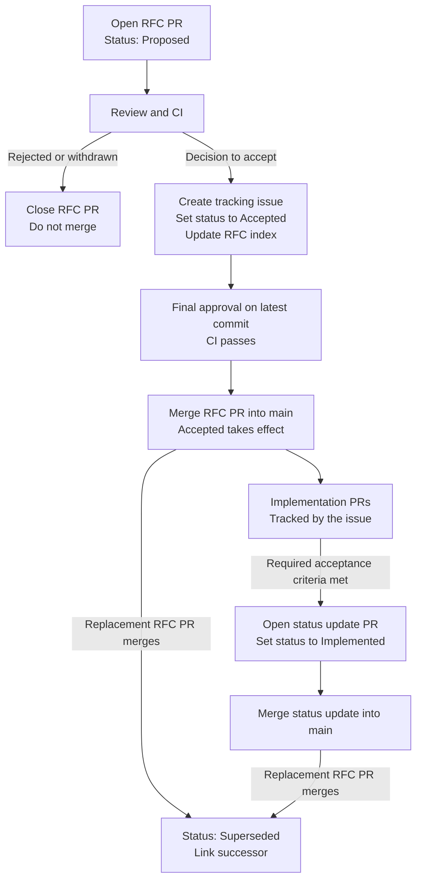

# actr RFCs

The Request for Comments (RFC) process provides a consistent review path for cross-cutting actr changes that are expensive to revise once adopted. These changes include protocol semantics, concurrency models, FFI and ABI contracts, and code generation contracts.

Many changes do not require an RFC. Bug fixes, documentation improvements, and refactoring contained within one crate should use the regular pull request process.

## Repository layout

```text
rfcs/
├── 0000-template.md               # Template for new RFCs
├── README.md                      # Process and conventions
├── text/                          # RFC documents in Markdown
│   └── NNNN-short-name.md
└── media/                         # Media referenced by RFCs
    └── <asset>
```

- Keep RFC proposal documents in `text/` and binary assets such as images and diagrams in `media/`.
- Reference media with relative links such as ``.
- **RFC documents must not use relative links to repository documents outside `rfcs/`.** Those documents may move or be deleted. References to code locations such as `core/.../file.rs` are allowed. Include necessary background directly in the RFC or link to an external issue or pull request.

## When an RFC is required

Write an RFC before implementation when a change does any of the following:

- changes the wire format or protocol, or adds caller-visible concurrency or reply semantics;
- requires coordinated changes across multiple crates or layers, such as `core/hyper`, `framework`, code generation, FFI, or WIT;
- introduces an API that will be difficult to withdraw after release, such as a protocol method option or host import;
- requires a durable decision among alternatives with meaningful trade-offs.

An RFC is not required when a change does any of the following:

- restates, reorganizes, or refactors existing behavior without changing semantics;
- incrementally improves an objective metric such as performance, platform coverage, parallelism, or warning coverage;
- remains internal and has no caller-visible effect.

## Submitting a new RFC

1. Copy `0000-template.md` to `text/<id>-<short-name>.md`. Use a zero-padded four-digit ID that is one greater than the highest ID already used in either the RFC index or any RFC pull request; start with `0001` when no RFC exists. Once a pull request is opened, its ID remains reserved even if the proposal is later closed. Append a language code before `.md` for a non-English version, for example `0001-explicit-reply.zh.md`.
2. Complete every section. Cite concrete code paths such as `core/.../file.rs` and relevant issue or pull request URLs. The `Alternatives` section must describe genuine rejected options; this requirement distinguishes an RFC from a regular design document.
3. Add the RFC to the index with `Proposed` status and open a pull request titled `docs: add RFC-NNNN <name>`. After GitHub assigns the pull request number, fill in the RFC PR metadata with its URL. Keep the tracking issue empty while the proposal is under review. A proposed RFC must not be merged.
4. Address review feedback and ensure CI passes. If the proposal is rejected or withdrawn, close the pull request without merging it.
5. After the maintainers decide to accept the proposal, create a tracking issue, set the RFC and index status to `Accepted`, and request final approval. The latest commit must have at least one maintainer approval and passing CI before the RFC pull request is merged into `main`. The merge is the point at which `Accepted` takes effect.
6. Track implementation pull requests and required acceptance criteria in the tracking issue. When all required work is merged, submit a follow-up documentation pull request that changes the RFC and index status to `Implemented`.
7. To replace an accepted or implemented RFC, submit a new RFC. When the maintainers decide to accept the replacement, use the replacement RFC pull request to set the original RFC to `Superseded`, link its successor in `Superseded by`, and update both index entries. Merging the replacement RFC pull request makes both status changes effective.

## RFC lifecycle



| Status | Meaning |
|---|---|
| Proposed | The RFC exists in an open pull request, remains under review, and must not be merged. |
| Accepted | The RFC pull request has merged into `main`, a tracking issue exists, and implementation may proceed. |
| Implemented | All required acceptance criteria and required implementation phases have merged. Optional phases and future possibilities do not block this status. |
| Superseded | A newer accepted RFC replaces this RFC and is linked in `Superseded by`. |

- `Accepted` is not a guarantee of implementation or a statement of priority.
- Rejected and withdrawn proposals are closed without merging; they are pull request outcomes, not persisted RFC statuses.
- Every status-changing pull request must update the RFC metadata and RFC index together.
- Avoid substantial changes to an accepted RFC. Submit small corrections in follow-up pull requests. Use a new RFC for material design changes and reference it from the original RFC.

## RFC index

| Number | Title | Status |
|---|---|---|
